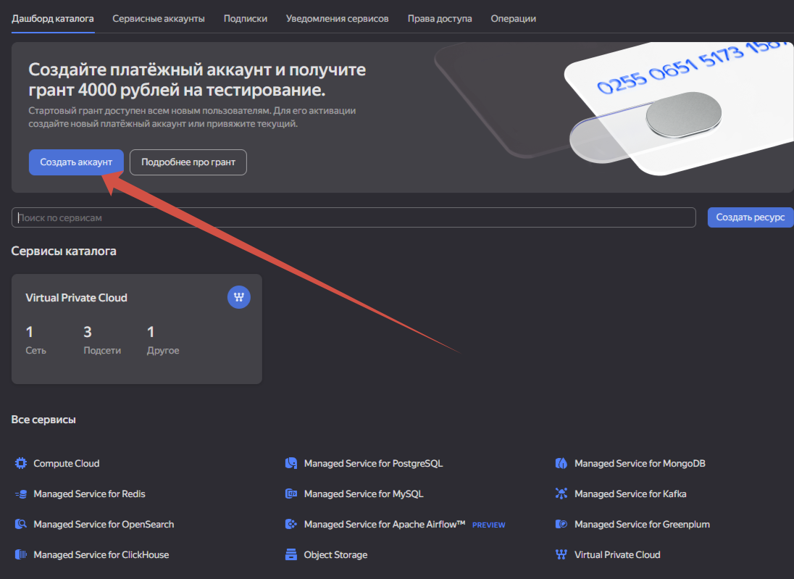
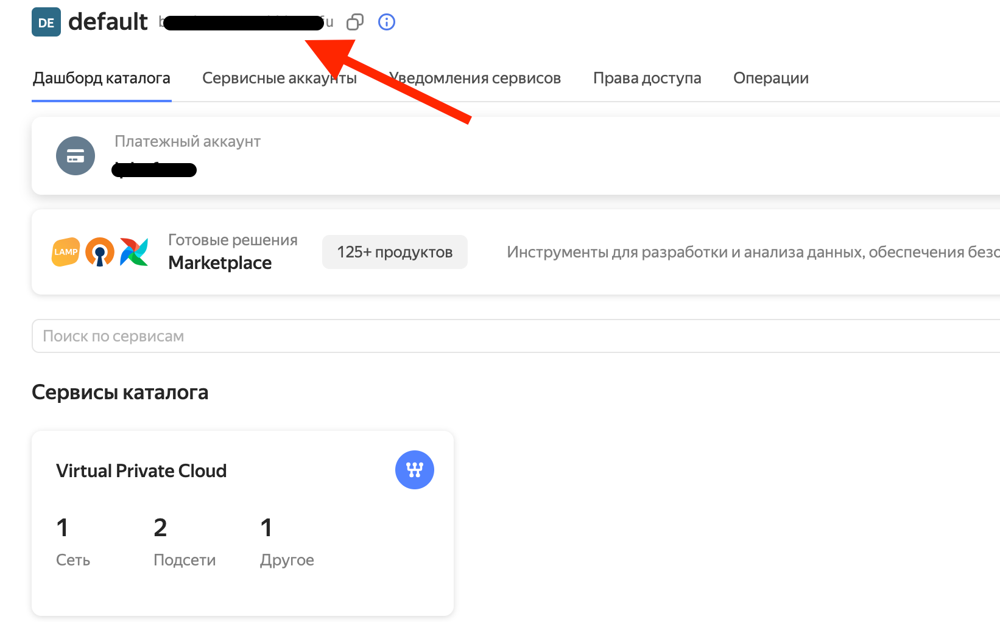
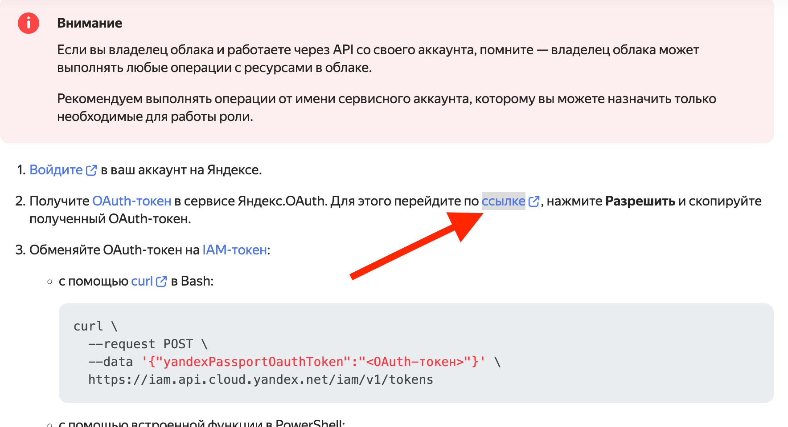
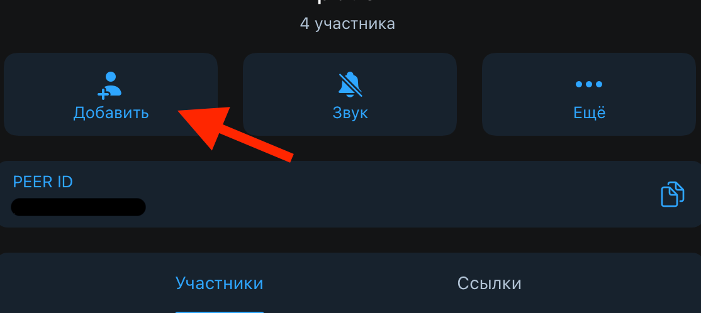
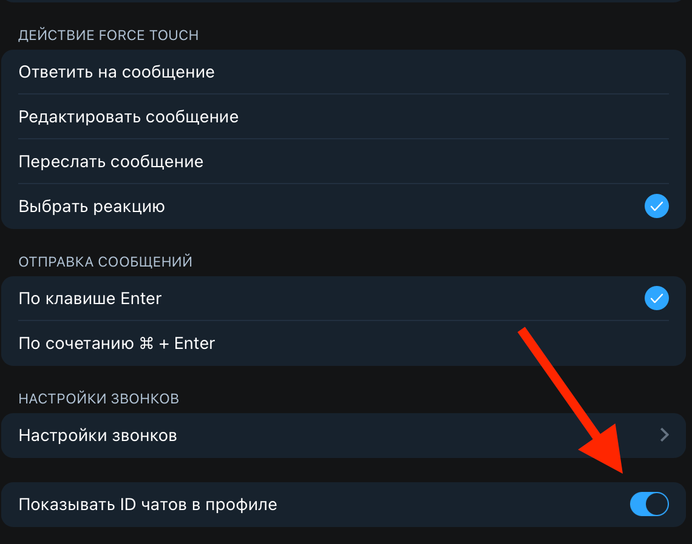
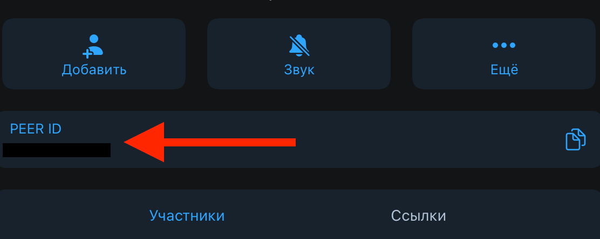

## Описание

Этот Telegram-бот использует Yandex GPT для обработки сообщений и создания постов для канала. Также бот может
предоставлять прогноз погоды для нескольких городов и автоматически публиковать посты по случайным темам из списка. Все
настройки, включая время отправки погоды и интервал между постами, настраиваются через файлы конфигурации.

## Структура проекта

Проект состоит из следующих файлов:

- `bot.py`: Основной скрипт, управляющий работой бота, обработки сообщений, получения погоды и публикации постов.
- `settings.json`: Файл конфигурации с настройками бота, темами для постов, временем отправки прогноза погоды и другими
  параметрами.
- `.env`: Файл для хранения чувствительных данных, таких как токены для API и бот-токены.
- `requirements.txt`: Список зависимостей проекта.

## Установка


Извините за недоразумение. Вот обновленные шаги с установкой Python:

1. **Установите Python**:

   - Для Windows:
     - Скачайте последнюю версию Python с официального сайта: [python.org/downloads](https://www.python.org/downloads/).
     - Во время установки убедитесь, что поставили галочку "Add Python to PATH", чтобы Python был доступен из командной строки.

   - Для macOS:
     - Используйте [Homebrew](https://brew.sh/), если он установлен:
       ```bash
       brew install python
       ```
     - Или скачайте Python с [официального сайта](https://www.python.org/downloads/).

   - Для Linux:
     - На Ubuntu/Debian:
       ```bash
       sudo apt update
       sudo apt install python3 python3-pip python3-venv
       ```

2. **Создайте виртуальное окружение**:

   После установки Python, выполните команду для создания виртуального окружения в каталоге вашего проекта:

   ```bash
   python3 -m venv venv
   ```

3. **Активируйте виртуальное окружение**:

   - На Windows:
     ```bash
     .\venv\Scripts\activate
     ```

   - На macOS/Linux:
     ```bash
     source venv/bin/activate
     ```

4. **Клонируйте репозиторий**:

   ```bash
   git clone https://github.com/Vaibron/YandexGPTTgBot.git
   ```

5. **Перейдите в директорию с проектом**:

   ```bash
   cd YandexGPTTgBot
   ```

6. **Установите зависимости**:

   ```bash
   pip install -r requirements.txt
   ```

### Зависимости:

- `requests==2.32.3`
- `python-telegram-bot==20.0`
- `APScheduler==3.10.4`
- `python-dotenv==1.0.1`

Теперь ваше виртуальное окружение настроено, и все зависимости установлены, переходим к настройке бота!

## Настройка

1. **Создание и настройка файла `.env`**

   Создайте файл `.env` в корневой директории проекта и добавьте в него следующие параметры:

   ```
   OAUTH_TOKEN=<OAuth токен Yandex>
   FOLDER_ID=<ID папки в Yandex Cloud>
   WEATHER_API_KEY=<API ключ для получения данных о погоде>
   BOT_TOKEN=<Токен вашего Telegram бота>
   CHAT_ID=<ID чата или канала в котором вы будете использовать бота>
   ```
   Для получения этих данных вам нужно будет зарегистрироваться и настроить соответствующие API на Yandex Cloud,
   Telegram и OpenWeatherMap.

2. **Создание и настройка Yandex Cloud**

   2.1. Регистрируемся на Yandex Cloud и создаем платежный аккаунт в https://console.yandex.cloud.

      

   2.2. Находим FOLDER_ID. Его можно найти на главной странице личного кабинета.

      

   2.3. Для получения OAUTH_TOKEN заходим сюда https://yandex.cloud/ru/docs/iam/operations/iam-token/create и нажимаем "перейдите по ссылке", после копируем токен.

      

3. **Получение WEATHER_API_KEY**

   **OpenWeatherMap** — это популярный онлайн-сервис, предоставляющий данные о погоде, включая прогнозы, текущую погоду,
   климатическую статистику и многое другое. Сервис предлагает API (интерфейс программирования приложений), который
   разработчики могут использовать для интеграции данных о погоде в свои проекты, включая мобильные приложения,
   веб-сайты и Telegram-боты.

   3.1. Зарегистрируйтесь на сайте:

    - Перейдите на сайт [OpenWeatherMap](https://openweathermap.org/).
    - Нажмите на кнопку **Sign Up** и создайте учетную запись, указав email и пароль.

   3.2. Подтвердите email:

    - После регистрации на указанный email придет письмо для подтверждения. Перейдите по ссылке из письма.

   3.3. Получите API ключ (токен):

    - После входа в учетную запись перейдите в раздел **API keys** в вашем личном кабинете.
    - Там вы увидите токен (API ключ), который можно использовать в запросах.

   Обычно вы получаете ключ вида:

   ```
   abc123def456ghi789jkl
   ```

4. **Получение BOT_TOKEN и CHAT_ID**

   4.1. Получение BOT_TOKEN:

    - Создайте бота через BotFather:
    - Откройте Telegram и найдите бота BotFather (официальный бот для создания и управления другими ботами). Его можно
      найти, введя в поиске @BotFather.
    - Напишите команду /newbot и следуйте инструкциям:
    - Дайте имя своему боту.
    - Придумайте уникальное имя пользователя (username) для бота, оно должно заканчиваться на bot (например,
      my_cool_bot).
    - После успешного создания, BotFather отправит вам BOT_TOKEN — уникальный ключ для вашего бота. Он будет выглядеть
      как длинная строка символов, например:
     ```
     123456789:AAHh...1qZXZ
     ```
   4.2. Добавьте вашего бота в группу или чат, используя тот же способ, что и для добавления обычного пользователя.
   
      

   4.3. Получение CHAT_ID:
    - Перейдите в настройки Telegram -> Общие, спуститесь вниз и включите "Показывать ID чатов в профиле"

       

    - Зайдите в чат, куда вы добавили бота. Скопируйте ваше число например "123456789" и добавьте "-100"
      перед числом, в качестве префикса.
      Должно получиться "-100123456789". Это и есть CHAT_ID.

       
   
   
5. **Настройка `settings.json`**

   Файл `settings.json` содержит настройки для бота. Ниже приведены основные параметры, которые можно изменить:

    - `bot_name`: Имя бота, которое будет использоваться в сообщениях.
    - `bot_behavior`: Описание поведения бота (например, его стиль общения).
    - `send_weather`: Если `"Да"`, бот будет отправлять прогноз погоды. Если `"Нет"`, эта функция будет выключена.
    - `weather_time`: Время отправки прогноза погоды (в формате HH:MM).
    - `cities_for_weather`: Список городов, для которых бот будет запрашивать данные о погоде.
    - `send_posts`: Если `"Да"`, бот будет регулярно публиковать посты в канале.
    - `posts_interval`: Интервал в минутах, с которым будут публиковаться посты.
    - `topics_list`: Список тем, по которым бот рандомно будет генерировать посты.

   Пример файла `settings.json`:

   ```json
   {
     "bot_name": "Бендер",
     "bot_behavior": "Тебя зовут Бендер. Ты генерируешь ответы по любой теме, как персонаж из Футурамы. Текст должен быть интересным и шуточным. Имя Бендер в тексты ты не указываешь",
     "send_weather": "Да",
     "weather_time": "08:30",
     "cities_for_weather": [
       "Москва",
       "Подольск"
     ],
     "send_posts": "Да",
     "posts_interval": 120,
     "topics_list": [
       "Введение в программирование",
       "Алгоритмы и структуры данных",
       "Языки программирования (Python, JavaScript, Java, C++, C#)",
       "Объектно-ориентированное программирование (ООП)"
     ]
   }
   ```

## Использование

1. **Запуск бота**

   Для запуска бота необходимо выполнить файл `bot.py`. Он автоматически подключится к Telegram и начнёт слушать
   входящие сообщения.

   ```bash
   python bot.py
   ```

2. **Команды бота**

    - `/start`: Отправляет приветственное сообщение пользователю.

3. **Функционал**

    - **Получение прогноза погоды**: Бот будет отправлять прогноз погоды для городов, указанных в настройках, в
      указанное время каждый день (если это включено в `settings.json`).
    - **Генерация постов**: Бот будет регулярно публиковать посты по случайной теме из списка, если эта функция
      включена.
    - **Обработка сообщений**: Бот будет отвечать на сообщения, в которых упоминается его имя. Для этого нужно, чтобы
      имя бота было указано в начале сообщения.

4. **Пример взаимодействия**

    - **Погода**: Каждый день в указанное время бот отправляет сообщение с прогнозом погоды для выбранных городов.
    - **Сообщения от пользователей**: Если пользователь отправляет сообщение, которое содержит имя бота, он получает
      ответ от Yandex GPT, который зависит от настроек и текста сообщения.

5. **Запуск бота на сервере**

   Для установки бота на сервер вы можете использовать одну из доступных видеоинструкций, например эту https://www.youtube.com/watch?v=HUElC48p64c


## Логирование

Бот ведёт логирование своей работы, что позволяет отслеживать ошибки и события. Логи будут выводиться в консоль, и они
будут содержать важную информацию, такую как ошибки при запросах, ответы от API и другую информацию, полезную для
отладки.

## Планировщик задач

Для регулярной отправки прогноза погоды и публикации постов используется библиотека `APScheduler`, которая позволяет
настроить задания с интервалом или по расписанию.

- **Прогноз погоды** отправляется по расписанию (если включено в `settings.json`).
- **Посты** публикуются с заданным интервалом в минутах.

## Примечания

- Убедитесь, что вы правильно настроили все параметры в `.env` и `settings.json`, прежде чем запускать бота.
- Для работы с Yandex API и получения GPT-ответов нужно иметь доступ к Yandex Cloud.
- Убедитесь, что ваш Telegram-бот имеет права на отправку сообщений в канал или группу, указанный в `CHAT_ID`.
